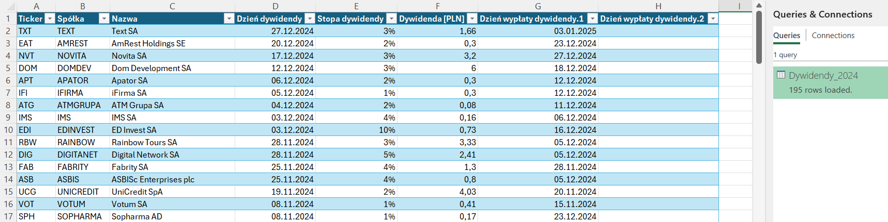
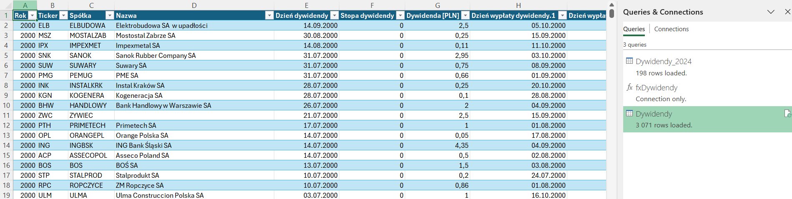
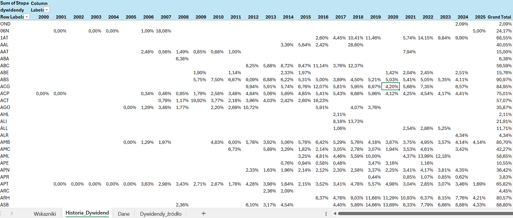
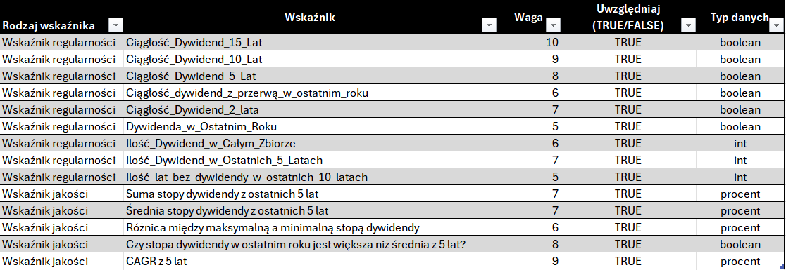
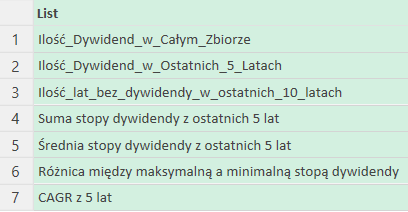
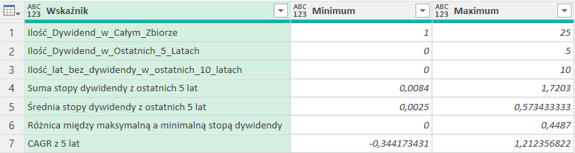

# EXCEL_power_query_dywidendy

## Opis projektu

Projekt to skoroszyt Excel, który automatyzuje proces pobierania danych z serwisu [strefa inwestorów](https://strefainwestorow.pl/).
Skoroszyt gromadzi informacje o spółkach notowanych na warszawskiej giełdzie (GPW), które od 2000 roku prowadziły politykę dywidendową. Dzięki wykorzystaniu Power Query, arkusz umożliwia szybkie i efektywne pobieranie oraz przetwarzanie tych danych, co pozwala na łatwiejsze śledzenie historii dywidendowej spółek.


## Krok 1: kwerenda z roku 2024

Kwerenda Dywidendy_2024 służy do pobierania i przetwarzania danych o dywidendach z roku 2024. Proces przetwarzania danych obejmuje następujące kroki:

**1. Pobranie zawartości strony.**

**2. Ekstrakcja tabeli HTML.**

**3. Ustawienie nagłówków.**

**4. Zamiana wartości:** Kwerenda dokonuje zamiany znaków w kolumnach "Stopa dywidendy" oraz "Dywidenda na akcję", zamieniając kropki na przecinki i usuwając znaki specjalne (np. "*").

**5. Dostosowanie kolumny "Dzień wypłaty dywidendy":** Komórki w tej kolumnie mogą zawierać do trzech różnych dat. W pierwszym kroku usuwane są wszelkie niepożądane znaki, pozostawiając tylko litery, cyfry oraz kropki. Następnie, wartości w tej kolumnie są dzielone na trzy oddzielne kolumny, każda zawierająca maksymalnie 10 znaków, aby umożliwić łatwiejsze przetwarzanie i analizę danych.

**6. Tworzenie kolumny "Dywidenda [PLN]":** Na podstawie danych w kolumnie "Dywidenda na akcję" tworzona jest nowa kolumna "Dywidenda [PLN]", która wyodrębnia wartość dywidendy w złotych.

**7. Usuwanie kolumny "Dywidenda na akcję":** Po utworzeniu nowej kolumny "Dywidenda [PLN]" usuwana jest oryginalna kolumna "Dywidenda na akcję".

**8. Reorganizacja kolumn:** Na koniec, kolumny są uporządkowane w logiczny sposób, aby ułatwić analizę danych.


```m
let
    // Pobranie zawartości strony internetowej
    Source = Web.BrowserContents("https://strefainwestorow.pl/dane/dywidendy/2024"),

    // Wydobycie danych z tabeli HTML
    #"Extracted Table From Html" = Html.Table(Source, 
        {
            {"Column1", "TABLE.table.d-none.d-lg-table.table-dividends-desktop.responsive-enabled.table-hover.table-striped > * > TR > :nth-child(1)"},
            {"Column2", "TABLE.table.d-none.d-lg-table.table-dividends-desktop.responsive-enabled.table-hover.table-striped > * > TR > :nth-child(2)"},
            {"Column3", "TABLE.table.d-none.d-lg-table.table-dividends-desktop.responsive-enabled.table-hover.table-striped > * > TR > :nth-child(3)"},
            {"Column4", "TABLE.table.d-none.d-lg-table.table-dividends-desktop.responsive-enabled.table-hover.table-striped > * > TR > :nth-child(4)"},
            {"Column5", "TABLE.table.d-none.d-lg-table.table-dividends-desktop.responsive-enabled.table-hover.table-striped > * > TR > :nth-child(5)"},
            {"Column6", "TABLE.table.d-none.d-lg-table.table-dividends-desktop.responsive-enabled.table-hover.table-striped > * > TR > :nth-child(6)"},
            {"Column7", "TABLE.table.d-none.d-lg-table.table-dividends-desktop.responsive-enabled.table-hover.table-striped > * > TR > :nth-child(7)"}
        },
        [RowSelector="TABLE.table.d-none.d-lg-table.table-dividends-desktop.responsive-enabled.table-hover.table-striped > * > TR"]
    ),
    #"Renamed Columns" = Table.RenameColumns(#"Extracted Table From Html",{{"Column1", "Spółka"}, {"Column2", "Ticker"}, {"Column3", "Nazwa"}, {"Column4", "Dzień dywidendy"}, {"Column5", "Stopa dywidendy"}, {"Column6", "Dywidenda na akcję"}, {"Column7", "Dzień wypłaty dywidendy"}}),
    #"Filtered Rows" = Table.SelectRows(#"Renamed Columns", each ([Spółka] <> "Spółka")),
    // Zmiana kropki na przecinek w kolumnach "Stopa dywidendy" i "Dywidenda na akcję"
    #"Replaced Value" = Table.ReplaceValue(#"Filtered Rows", ".", ",", Replacer.ReplaceText, {"Stopa dywidendy", "Dywidenda na akcję"}),

    // Usuwanie znaków "*" w kolumnach "Stopa dywidendy", "Dywidenda na akcję" i "Dzień wypłaty dywidendy"
    #"Replaced Value1" = Table.ReplaceValue(#"Replaced Value", "*", "", Replacer.ReplaceText, {"Stopa dywidendy", "Dywidenda na akcję", "Dzień wypłaty dywidendy"}),

    // Usuwanie niechcianych znaków w kolumnie "Dzień wypłaty dywidendy" (zostawiamy tylko litery, cyfry i kropki)
    #"Trimmed Text" = Table.TransformColumns(#"Replaced Value", {"Dzień wypłaty dywidendy", each Text.Select(_, {"a".."z", "A".."Z", "0".."9", "."})}),

    // Podział kolumny "Dzień wypłaty dywidendy" na trzy oddzielne kolumny
    #"Split Column by Position" = Table.SplitColumn(#"Trimmed Text", "Dzień wypłaty dywidendy", Splitter.SplitTextByRepeatedLengths(10), 
        {"Dzień wypłaty dywidendy.1", "Dzień wypłaty dywidendy.2", "Dzień wypłaty dywidendy.3"}
    ),

    // Dodanie nowej kolumny "Dywidenda [PLN]" na podstawie danych z "Dywidenda na akcję"
    #"Added Custom" = Table.AddColumn(#"Split Column by Position", "Dywidenda [PLN]", each 
        if Text.Contains([Dywidenda na akcję], "(") then
            Text.BeforeDelimiter(Text.BetweenDelimiters([Dywidenda na akcję], "(", ")"), "zł")
        else 
            Text.Select([Dywidenda na akcję], {"0".."9", ","})
    ),

    // Usunięcie kolumny "Dywidenda na akcję" po obliczeniu wartości
    #"Removed Columns" = Table.RemoveColumns(#"Added Custom", {"Dywidenda na akcję"}),

    // Przekształcenie kolejności kolumn
    #"Reordered Columns" = Table.ReorderColumns(#"Removed Columns", 
        {"Ticker", "Spółka", "Nazwa", "Dzień dywidendy", "Stopa dywidendy", "Dywidenda [PLN]", "Dzień wypłaty dywidendy.1", "Dzień wypłaty dywidendy.2", "Dzień wypłaty dywidendy.3"}
    )

in
    #"Reordered Columns"
```


W wyniku kwerendy otrzymujemy tabelę z danymi o dywidendach dla spółek za 2024 rok, gotową do dalszej analizy i raportowania.




## Krok 2: kwerenda obejmująca okres od roku 2000 do aktualnego roku 


Aby zebrać dane z kilku stron została zdefiniowana funkcja fxDywidendy, a następnie z jej użyciem utworzona kwerenda z danych z całego wskazanego okresu.


**1. Funkcja fxDywidendy** jest prawie identyczna jak w przypadku wcześniejszej kwerendy, tylko z dodaniem parametru year, który umożliwia dynamiczne wywołanie kwerendy dla dowolnego roku.
 
Kod dla funkcji fxDywidendy:

```m
(year) as table =>

let
    Source = Web.BrowserContents("https://strefainwestorow.pl/dane/dywidendy/" & Text.From(year)),
...(pozostały kod z kwerendy Dywidendy_2024)...
```

**2. Kwerenda:**

- Tworzy listę lat ze wskazanego zakresu, generuje liczby od 2000 do aktualnego roku (np. w 2025 roku: od 2000 do 2025).

- Dla każdego roku wykonuje następujące operacje:
Konwertuje liczbę na tekst (Text.From(_)) i przypisuje do kolumny "Rok".
- Wywołuje funkcję fxDywidendy(Rok), która zwraca tabelę z danymi dywidend dla danego roku i przypisuje wynik do kolumny "Tabele".
- Konwersja do tabeli: Table.FromRecords(Source) 

W wyniku działania tej kwerendy otrzymana zostaje jedna tabela z danymi dywidend dla wszystkich lat od 2000 do roku bieżącego, gotową do dalszej analizy.

```m
let
    Source = List.Transform({2000..Date.Year(DateTime.LocalNow())}, 
        each [ Rok = _, Tabele = fxDywidendy(_) ]  
        // Przekazujemy liczbę do funkcji
    ),
    TableResult = Table.FromRecords(Source),
    //Konwertuje listę rekordów na tabelę
    #"Expanded Tabele" = Table.ExpandTableColumn(TableResult, "Tabele", 
        {"Ticker", "Spółka", "Nazwa", "Dzień dywidendy", "Stopa dywidendy", "Dywidenda [PLN]", "Dzień wypłaty dywidendy.1", "Dzień wypłaty dywidendy.2", "Dzień wypłaty dywidendy.3"}
    ),
    #"Changed Type" = Table.TransformColumnTypes(#"Expanded Tabele",{{"Rok", Int64.Type}, {"Ticker", type text}, {"Spółka", type text}, {"Nazwa", type text}, {"Dzień dywidendy", type date}, {"Stopa dywidendy", Percentage.Type}, {"Dywidenda [PLN]", type number}, {"Dzień wypłaty dywidendy.1", type date}, {"Dzień wypłaty dywidendy.2", type date}, {"Dzień wypłaty dywidendy.3", type date}})
in
    #"Changed Type"
```



## Krok 3: Czyszczenie danych
Pobrane dane są w dobrym stanie, dlatego tylko drobne poprawki były wymagane.

- Na samym początku dane uzyskane w poprzednim kroku są kopiowane do nowego arkusza "Dane", żeby nie zostały nadpisane przy odświeżaniu kwerendy

- Typy danych zostały przypisane poprawnie już na etapie Power Query

- Część danych z aktualnego roku nie jest jeszcze pewna, brak jest daty wypłacania dywidendy czy też jej wysokość, dlatego najrozsądniej będzie pominąć cały rok przy wstępnej analizie spółek. Dane choć jeszcze niepełne będzie można użyć na późniejszym etapie analizy dlatego zostają w tabeli

- Części wpisów brakuje nazwy spółki, ale jest to łatwe do naprawienia

## Krok 4: Wstępne zwizualizowanie stopy dywidendy
W celu sprawdzenia jak na przestrzeni lat zmeniały się stopy dywidend dla poszczególnych spółek należy zbudować tabelę przestawną. Tego typu tabela pomoże zobrazować dane w sposób, który umożliwia łatwą analizę trendów i porównań między spółkami oraz latami.
1. W obszarze wierszy wybrano "Ticker" (spółkę).
2. W obszarze kolumn wybrano "Rok".
3. W obszarze wartości wybrano "Stopa dywidendy", ustawiając suma jako funkcję agregującą.



Tabela może się przydać przy weryfikowaniu poprawności wyliczonych wskaźników.

## Krok 5: Przygotowanie wskaźników

Aby dobrać najlepsze spółki dywidendowe przygotowane zostaną wskaźniki, które odnosząc się do danych historycznych pozwolą znaleźć spółki stabilne pod względem częstotliwości wypłaty oraz jakości wypłaty(stabilność stopy dywidendy). Wskaźniki uzyskane zostaną przy pomocy Power Query w dwóch zapytaniach na podstawie uzyskanych danych z poprzednich kroków:
- Wskaźniki_regularności
- Wskaźniki_jakości

 Każdy wskaźnik ma przypisaną wagę, która będzie brana pod uwage podczas analizy.

### Krok 5.1 Wskaźniki regularności wypłaty dywidendy (Stabilność historyczna) 

W zapytaniu Wskaźniki_regularności przygotowano parametry:
- ilość dywidend z ostatnich 15 lat ➝ Waga: 10
- ilość dywidend z ostatnich 10 lat ➝ Waga: 8
- ilość dywidend z ostatnich 5 lat ➝ Waga: 7
- brak dywidendy w ostatnim roku, ale w 9 poprzednich latach była ➝ Waga: 6
- dywidenda w ostatnim i poprzednim roku ➝ Waga: 7
- Dywidenda w ostatnim roku ➝ Waga: 4
- Ilość lat z dywidendą w całym zbiorze ➝ Waga: 6
- Ilość lat z dywidendą w ostatnich 5 latach ➝ Waga: 7
- Ilość lat bez dywidendy w ostatnich 10 latach ➝ Waga: 5

Całe zapytanie do obliczenia powyższych parametrów:
```m
let
    Source = Dywidendy_źródło,
    // Pobranie tylko kolumn "Rok" i "Ticker", usunięcie duplikatów
    Unikalne_dane = Table.Distinct(Table.SelectColumns(Source,{"Rok", "Ticker"})),

    // Funkcja zwracająca listę lat, 
    Aktualny_rok = Date.Year(DateTime.LocalNow()),
    Ciągłość_Dywidend = (Lata as number, ListaLatDywidend as list) => 
        List.Count(List.Difference(List.Numbers(Aktualny_rok-Lata, Lata), List.Distinct(ListaLatDywidend))),

    // Sprawdzenie Regularności wypłaty dywidendy
    Wskazniki_regularności = Table.Group(Unikalne_dane,"Ticker", {  
        {"Ciągłość_Dywidend_15_Lat",each Ciągłość_Dywidend(15,[Rok]) = 0, type logical},
        {"Ciągłość_Dywidend_10_Lat",each Ciągłość_Dywidend(10,[Rok]) = 0, type logical},
        {"Ciągłość_Dywidend_5_Lat",each Ciągłość_Dywidend(5,[Rok]) = 0, type logical},
        {"Ciągłość_dywidend_10_Lat_z_przerwą_w_ostatnim_roku", each 
            let 
                brakDywidendyOstatni = List.Contains([Rok], Aktualny_rok - 1) = false,
                lataBezDywidendy = Ciągłość_Dywidend(10,[Rok]) = 1
            in 
                brakDywidendyOstatni and lataBezDywidendy},
        {"Ciągłość_Dywidend_2_lata", each Ciągłość_Dywidend(2,[Rok]) = 0, type logical},
        {"Dywidenda_w_Ostatnim_Roku", each List.Contains([Rok],Aktualny_rok - 1), type logical},
        {"Ilość_Dywidend_w_Całym_Zbiorze", each List.Count([Rok])},
        {"Ilość_Dywidend_w_Ostatnich_5_Latach", each 5 - Ciągłość_Dywidend(5,[Rok])},
        {"Ilość_lat_bez_dywidendy_w_ostatnich_10_latach", each Ciągłość_Dywidend(10,[Rok])}
        }),

    Posortowane_wyniki = Table.Sort(Wskazniki_regularności,{{"Ticker", Order.Ascending}})
in
    Posortowane_wyniki
```

Opis jednego z parametrów (pozostałe obliczane są w analogiczny sposób):

- Ze względu na powtarzalność obliczeń, stworzono funkcję Ciągłość_Dywidend, która zwraca liczbę lat, w których dywidenda nie była wypłacona w analizowanym okresie. Porównuje ona oczekiwane lata wypłaty dywidendy z latami, w których faktycznie została wypłacona.
```m
Ciągłość_Dywidend = (Lata as number, ListaLatDywidend as list) => 
    List.Count(List.Difference(List.Numbers(Aktualny_rok-Lata, Lata), List.Distinct(ListaLatDywidend))),
```
- Dane są grupowane według Tickera, a następnie dla każdego z nich obliczane są odpowiednie wskaźniki, które zapisywane są w nowych kolumnach. Przykładowo, wskaźnik Ciągłość_Dywidend_15_Lat sprawdza, czy dywidenda była wypłacana nieprzerwanie przez ostatnie 15 lat (licząc od roku poprzedniego).
```
...
Wskazniki_regularności = Table.Group(Unikalne_dane,"Ticker", {
        {"Ciągłość_Dywidend_15_Lat",each Ciągłość_Dywidend(15,[Rok]) = 0, type logical},
...
```
Dzięki temu podejściu funkcja może być wielokrotnie wykorzystywana do obliczania wskaźników dla różnych przedziałów czasowych.


### Krok 5.2 Wskaźniki jakości dywidendy (Wzrost i stabilność stopy)

Wskaźniki jakości dywidendy, takie jak wzrost i stabilność stopy dywidendy, zostały obliczone na podstawie danych z ostatnich 5 lat. Ze względu na złożoność zagadnienia oraz fakt, że dopiero uczę się zaawansowanej analizy danych, w procesie skorzystano ze wsparcia modelu językowego ChatGPT.

- Suma stopy dywidendy z ostatnich 5 lat ➝ Waga: 6
- Średnia stopa dywidendy z 5 lat ➝ Waga: 6
- Czy stopa dywidendy w ostatnim roku jest większa niż średnia z 5 lat? (Stabilność i wzrost) ➝ Waga: 8
- Najwyższa i najniższa stopa dywidendy w ostatnich 5 latach ➝ Waga: 5
- CAGR dywidendy z ostatnich 5 lat (średnioroczny wzrost dywidendy w %) ➝ Waga: 9

```m
let
    // Źródło danych o dywidendach
    Source = Dywidendy_źródło,

    // Grupowanie danych po kolumnie "Ticker" i "Rok", z obliczeniem sumy stopy dywidendy dla danego roku
    Grupa_danych_dla_roku_i_tikera = 
        Table.Group(
            Source, 
            {"Ticker", "Rok"}, 
            {
                {"Roczna Stopa dywidendy", each List.Sum([Stopa dywidendy]), Percentage.Type}
            }
        ),

    // Odfiltrowanie danych dla ostatnich 5 lat
    Dane_za_ostatnie_5_lat = 
        Table.SelectRows(
            Grupa_danych_dla_roku_i_tikera, 
            each List.Contains(List.Numbers(Date.Year(DateTime.LocalNow()) - 5, 5), [Rok])
        ),

    // Obliczenie wskaźników - Suma, Średnia, Min i Max stopy dywidendy z ostatnich 5 lat
    Wskaźniki_Suma_i_Średnia_5_lat = 
        Table.Group(
            Dane_za_ostatnie_5_lat,
            "Ticker",
            {
                {"Suma stopy dywidendy z ostatnich 5 lat", each List.Sum([Roczna Stopa dywidendy]), Percentage.Type},
                {"Średnia stopy dywidendy z ostatnich 5 lat", each List.Average([Roczna Stopa dywidendy]), Percentage.Type},
                {"Minimalna stopa dywidendy z ostatnich 5 lat", each List.Min([Roczna Stopa dywidendy]), Percentage.Type},
                {"Maksymalna stopa dywidendy z ostatnich 5 lat", each List.Max([Roczna Stopa dywidendy]), Percentage.Type}
            }
        ),

    // Obliczanie różnicy między maksymalną a minimalną stopą dywidendy
    Tabela_z_Obliczeniem_różnicy_max_min = 
        Table.AddColumn(
            Wskaźniki_Suma_i_Średnia_5_lat, 
            "Różnica między maksymalną a minimalną stopą dywidendy", 
            each [Maksymalna stopa dywidendy z ostatnich 5 lat] - [Minimalna stopa dywidendy z ostatnich 5 lat], 
            Percentage.Type
        ),

    // Obliczenie stopy dywidendy za ostatni rok
    Dane_dla_ostatniego_roku_temp = 
        Table.SelectRows(Grupa_danych_dla_roku_i_tikera, each [Rok] = Date.Year(DateTime.LocalNow()) - 1),

    // Usuwanie kolumny "Rok" (niepotrzebna)
    Dane_dla_ostatniego_roku = 
        Table.RemoveColumns(Dane_dla_ostatniego_roku_temp, {"Rok"}),  

    // Łączenie wskaźników z danymi za ostatni rok
    Wskaźniki_z_ostatnim_rokiem = 
        Table.NestedJoin(
            Tabela_z_Obliczeniem_różnicy_max_min, 
            "Ticker", 
            Dane_dla_ostatniego_roku, 
            "Ticker", 
            "Stopa ostatni rok", 
            JoinKind.FullOuter
        ),

    // Rozwijanie tabeli, aby dodać dane o stopie dywidendy za ostatni rok
    Tabela_rozwinięta_z_ostatnim_rokiem = 
        Table.ExpandTableColumn(
            Wskaźniki_z_ostatnim_rokiem, 
            "Stopa ostatni rok", 
            {"Roczna Stopa dywidendy"}
        ),

    // Dodanie kolumny porównującej stopę dywidendy za ostatni rok z średnią z ostatnich 5 lat
    Tabela_Porównanie_stopy_dywidendy = 
        Table.AddColumn(
            Tabela_rozwinięta_z_ostatnim_rokiem, 
            "Czy stopa dywidendy w ostatnim roku jest większa niż średnia z 5 lat?", 
            each [Roczna Stopa dywidendy] > [Średnia stopy dywidendy z ostatnich 5 lat], 
            type logical
        ),

    // Uzyskiwanie pierwszej i ostatniej stopy dywidendy dla każdej spółki z zakresu 5 ostatnich lat
    Stopa_początkowa_i_końcowa = 
        Table.Group(
            Dane_za_ostatnie_5_lat,
            "Ticker",
            {
                {
                    "Stopa początkowa wartość", 
                    each 
                        let 
                            Posortowane = Table.Sort(_, {{"Rok", Order.Ascending}})
                        in 
                            Posortowane[Roczna Stopa dywidendy]{0}, 
                    Percentage.Type
                },
                {
                    "Stopa końcowa wartość", 
                    each 
                        let 
                            Posortowane = Table.Sort(_, {{"Rok", Order.Descending}})
                        in 
                            Posortowane[Roczna Stopa dywidendy]{0}, 
                    Percentage.Type
                }
            }
        ),

    // Dodanie kolumny CAGR
    Tabela_z_CAGR = 
        Table.AddColumn(
            Stopa_początkowa_i_końcowa, 
            "CAGR z 5 lat", 
            each 
                let
                    początkowa = [Stopa początkowa wartość],
                    końcowa = [Stopa końcowa wartość],
                    lata = 5
                in
                    if początkowa > 0 and końcowa > 0 then
                        Number.Power((końcowa / początkowa), (1 / lata)) - 1
                    else 
                        null,
            Percentage.Type
        ),

    // Połączenie tabel z wynikami CAGR
    Tabela_ze_wskaźnikami = 
        Table.NestedJoin(
            Tabela_Porównanie_stopy_dywidendy, 
            "Ticker", 
            Tabela_z_CAGR, 
            "Ticker", 
            "CAGR", 
            JoinKind.FullOuter
        ),

    Rozwinięta_Tabela_ze_wskaźnikami = 
        Table.ExpandTableColumn(
            Tabela_ze_wskaźnikami,
            "CAGR",
            {"CAGR z 5 lat"}
        ),

    // Sortowanie wyników po Tickerze
    Posortowane_wyniki = 
        Table.Sort(
            Rozwinięta_Tabela_ze_wskaźnikami, 
            {{"Ticker", Order.Ascending}}
        )
in
    Posortowane_wyniki
```

## Krok 6: Normalizacja punktacji

Po wyznaczeniu wszystkich wskaźników konieczne jest ich znormalizowanie, czyli przekształcenie do wspólnej skali. Wynika to z faktu, że wskaźniki różnią się między sobą typem danych:

- int (np. Ilość_Dywidend_w_Całym_Zbiorze),

- boolean (np. Ciągłość_Dywidend_15_Lat),

- procent (np. Suma stopy dywidendy z ostatnich 5 lat).

W celu uporządkowania procesu normalizacji, w arkuszu Tabela sterująca przygotowano zestawienie zawierające kluczowe informacje o każdym wskaźniku: jego wagę, typ danych, a także kolumnę "Uwzględniaj", która umożliwia elastyczne decydowanie o tym, czy dany wskaźnik ma zostać uwzględniony w końcowej analizie, czy też pominięty.



Powyższa tabela została wczytana do Power Query pod nazwą Parametry_Punktacji.


W celu obliczenia minimum i maksimum dla każdego wskaźnika o typie int oraz procent, potrzebne jest pobranie listy wskaźników z takimi typami danych. Poniżej kwerenda Parametry_scoringu_normalizacja:

```m
let
    Source = Parametry_Punktacji,
    #"Filtered Rows" = Table.SelectRows(Source, each ([Typ danych] <> "boolean")),
    #"Renamed Columns" = Table.RenameColumns(#"Filtered Rows",{{"Wskaźnik", "Lista kolumn"}}),
    #"Removed Other Columns" = Table.SelectColumns(#"Renamed Columns",{"Lista kolumn"}),
    #"Lista kolumn" = #"Removed Other Columns"[Lista kolumn]
in
    #"Lista kolumn"
```

Jej wynikiem jest lista:




Poniżej kwerenda "Zakresy_Wskaźników" do wyznaczenia zakresu min-max dla wskaźników do normalizacji:

```m
let
    Source = Wszystkie_wskaźniki,
    Kolumny_do_normalizacji = 
        Table.SelectColumns(
            Source, 
            Parametry_Punktacji_Normalizacja
        ),
    Nagłówki_do_wiersza = Table.DemoteHeaders(Kolumny_do_normalizacji),
    Transpozycja_tabeli = Table.Transpose(Nagłówki_do_wiersza),
    Zmiana_nazwy_kolumny = Table.RenameColumns(Transpozycja_tabeli,{{"Column1", "Wskaźnik"}}),
    Wstawienie_minimum = 
        Table.AddColumn(
            Zmiana_nazwy_kolumny, 
            "Minimum", 
            each List.Min(Record.ToList(Record.RemoveFields(_,{"Wskaźnik"})))),
    Wstawienie_maximum = 
        Table.AddColumn(
            Wstawienie_minimum, 
            "Maximum", 
            each List.Max(Record.ToList(Record.RemoveFields(_,{"Wskaźnik"})))),
    Tabela_min_max = 
        Table.SelectColumns(
            Wstawienie_maximum,
            {"Wskaźnik", "Minimum", "Maximum"}
        )
in
    Tabela_min_max
```

Wyznaczone wskaźniki o typie danych int oraz procent wraz z wartościami minimalnymi i maksymalnymi:




## Krok 7: Przygotowanie tabeli punktacji